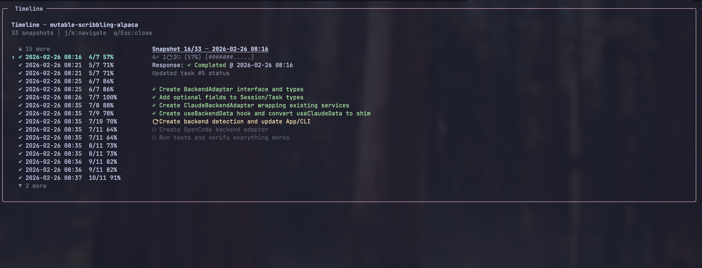

# CLIboard

A terminal dashboard for monitoring AI coding agent sessions and tasks. Think lazygit, but for your AI agent's task lists. Supports [Claude Code](https://docs.anthropic.com/en/docs/claude-code) and [OpenCode](https://github.com/opencode-ai/opencode), with [Codex CLI](https://github.com/openai/codex) planned.

CLIboard reads agent data directories on your machine and presents all sessions, tasks, activity, and timeline data in an interactive TUI — no configuration needed.




## Features

- **Multi-backend support** — works with Claude Code and OpenCode out of the box; auto mode merges sessions from all detected backends into a single list
- **Backend badges** — each session shows a `C` (Claude) or `O` (OpenCode) badge; live sessions get a shining animation
- **Session list** — browse all sessions across projects, sorted by last modified
- **Kanban board** — view tasks grouped by status (pending / in-progress / completed)
- **Activity panel** — see every tool call, sub-agent spawn, MCP invocation, slash command, and hook in a session
- **Timeline view** — step through task snapshots to see how work progressed over time, including agent response status
- **Concurrency graph** — visual indicators showing parallel tool/agent execution
- **Live session detection** — sessions with recent activity are marked as live
- **Project filtering** — scope the view to a single project with `--project`
- **Auto-refresh** — polls for changes every 200ms with smart mtime-based caching

## Install

```bash
npm install -g cliboard
```

Requires Node.js >= 18.

For OpenCode support, `better-sqlite3` is installed automatically as an optional dependency. If it fails to build on your system, Claude Code will still work normally.

## Usage

```bash
# Launch the interactive TUI dashboard (auto-detects backend)
cliboard

# Force a specific backend
cliboard --backend opencode
cliboard --backend claude

# Scope to a specific project directory
cliboard --project /path/to/your/project

# Use a custom Claude config directory (default: ~/.claude)
cliboard --dir /path/to/.claude

# Subcommands for scripting
cliboard list              # List all tasks (tab-separated)
cliboard list --json       # List all tasks as JSON
cliboard show <id>         # Show a specific task
cliboard watch             # Watch tasks directory for file changes (Claude Code only)
```

### Backend detection

When `--backend` is not specified (or set to `auto`), CLIboard detects all available backends and merges them:

| Backend | Data source | Detected by |
|---|---|---|
| Claude Code | `~/.claude/` (JSONL + JSON files) | Directory exists |
| OpenCode | `~/.local/share/opencode/opencode.db` (SQLite) | DB file exists |

If multiple backends are detected, sessions from all backends are merged into a single list sorted by last modified, with `C`/`O` badges to distinguish the source. If only one backend is found, it runs in single-backend mode with no overhead.

### Environment variables

| Variable | Description | Default |
|---|---|---|
| `CLAUDE_DIR` | Path to Claude config directory | `~/.claude` |

Priority: `--dir` flag > `CLAUDE_DIR` env > `~/.claude`

### Backend capabilities

| Feature | Claude Code | OpenCode |
|---|---|---|
| Session list | Yes | Yes |
| Task kanban | Yes | Yes |
| Activity panel | Yes | Yes |
| Timeline view | Yes | Yes |
| Git branch display | Yes | No |
| Live session detection | Yes | Yes |
| Sub-agent tracking | Yes | Yes |
| Task priority display | No | Yes |

## Keyboard shortcuts

### Global

| Key | Action |
|---|---|
| `q` | Quit |
| `?` | Help |
| `Tab` | Switch panel (sidebar / kanban) |

### Session list

| Key | Action |
|---|---|
| `j` / `k` | Navigate up/down |
| `g` / `G` | Jump to first/last |
| `Enter` | Select session |
| `f` | Cycle filter (All / Active / Archived) |
| `t` | Open timeline |
| `a` | Open activity panel |

### Kanban board

| Key | Action |
|---|---|
| `h` / `l` | Move between columns |
| `j` / `k` | Move between rows |
| `Enter` | Open task detail |

### Timeline / Activity / Detail

| Key | Action |
|---|---|
| `j` / `k` | Navigate |
| `q` / `Esc` | Close overlay |

## Architecture

```
src/
  cli.tsx                  # Entry point, commander setup, --backend flag
  App.tsx                  # Root component, panel routing, keybindings
  commands/
    list.tsx               # `cliboard list` subcommand
    show.tsx               # `cliboard show <id>` subcommand
    watch.ts               # `cliboard watch` subcommand
  components/
    Sidebar.tsx            # Session list with scroll + filter
    SessionItem.tsx        # Single session row (name, C/O badge, shining live indicator)
    NavigableKanban.tsx    # Keyboard-navigable kanban wrapper
    KanbanBoard.tsx        # 3-column board (pending/in-progress/completed)
    KanbanColumn.tsx       # Single kanban column
    TaskCard.tsx           # Single task card
    TaskDetailOverlay.tsx  # Full task detail view
    TimelineOverlay.tsx    # Step-through task snapshot timeline
    ActivityOverlay.tsx    # Tool/agent/hook activity feed
    HelpOverlay.tsx        # Keyboard shortcut reference
  hooks/
    useBackendData.ts      # Backend-agnostic data hook (sessions, tasks, polling)
    useClaudeData.ts       # Claude-specific shim (backwards compatibility)
  lib/
    backends/
      types.ts             # BackendAdapter interface, BackendCapabilities
      detect.ts            # Auto-detection and adapter factory
      claude/
        adapter.ts         # Claude Code adapter (JSONL + JSON files)
      opencode/
        adapter.ts         # OpenCode adapter (SQLite)
      composite/
        adapter.ts         # Merges multiple backends into one adapter
    metadataService.ts     # Claude: session metadata from projects/ JSONL files
    taskDataService.ts     # Claude: task lists from todos/ JSON files
    timelineService.ts     # Claude: JSONL into task snapshots over time
    activityService.ts     # Claude: tool calls, agents, skills from JSONL
    constants.ts           # Shared config (cache TTL, polling interval, etc.)
    types.ts               # TypeScript type definitions
```

### How it works

**Claude Code** stores session data in `~/.claude/`:
- **`projects/<encoded-path>/`** — one directory per project, containing `.jsonl` session logs and `sessions-index.json`
- **`todos/`** — task list JSON files (`<session-uuid>-agent-<agent-uuid>.json`)

**OpenCode** stores data in `~/.local/share/opencode/opencode.db` (SQLite):
- **`session`** table — session metadata with project links
- **`todo`** table — tasks with status, priority, and position
- **`part`** table — tool calls and sub-agent activity as JSON blobs
  - Timeline snapshots are reconstructed from `todowrite`/`todo_write` tool parts, with response state (`running/completed/error`)

CLIboard reads these data sources (read-only) and presents them in an interactive UI built with [Ink](https://github.com/vadimdemedes/ink) (React for the terminal). The `BackendAdapter` interface abstracts the data source, so adding new backends is straightforward.

### Performance

The caching system is designed to minimize I/O:

- **Mtime-based staleness** — polling checks `stat()` on the data source instead of re-reading all files. If nothing changed, zero files are read.
- **Keyed metadata cache** — project-filtered views only load sessions for that project.
- **Activity/timeline result caching** — parsed results are cached by file/DB mtime. Re-opening a panel is instant.
- **Directory listing cache** — the `todos/` directory listing is cached with a 5s TTL.

## Development

```bash
# Install dependencies
npm install

# Run tests
npm test

# Run tests in watch mode
npm run test:watch

# Build the CLI bundle
npm run build

# Install locally for testing
npm install -g .
```

### Tech stack

- **[Ink](https://github.com/vadimdemedes/ink)** — React renderer for CLIs
- **[Commander](https://github.com/tj/commander.js)** — CLI argument parsing
- **[better-sqlite3](https://github.com/WiseLibs/better-sqlite3)** — SQLite driver (optional, for OpenCode)
- **[Chokidar](https://github.com/paulmillr/chokidar)** — Filesystem watching
- **[esbuild](https://esbuild.github.io/)** — Bundler
- **[Vitest](https://vitest.dev/)** — Test runner

## Roadmap

- [ ] Support [Codex CLI](https://github.com/openai/codex) session monitoring (pending Codex adding a task/todo system)
- [ ] Incremental refresh with filesystem watcher (replace polling)
- [ ] Configurable refresh interval via CLI flag
- [x] Cross-backend session merging with source badges

## License

MIT
