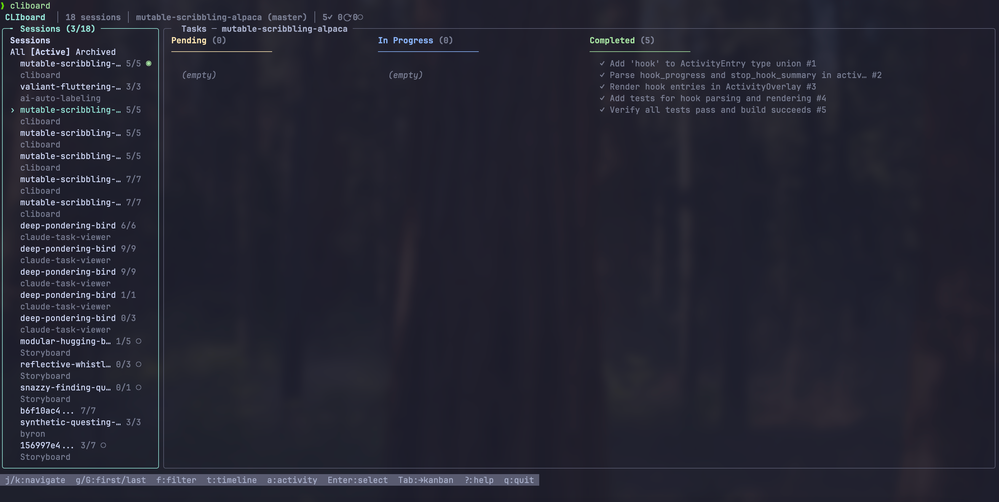
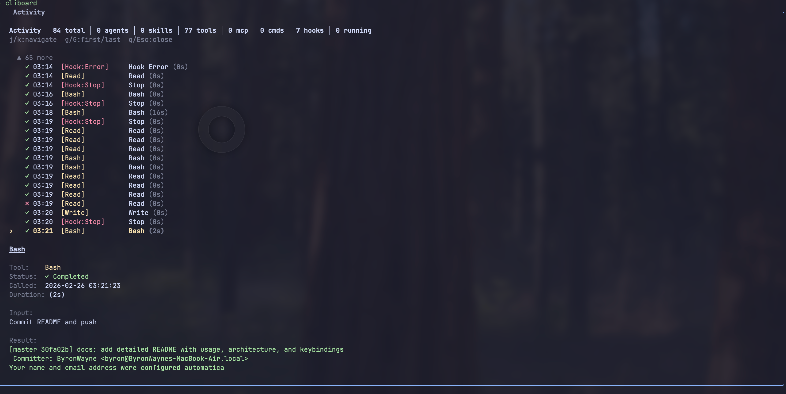

# CLIboard

A terminal dashboard for monitoring AI coding agent sessions and tasks. Think lazygit, but for your AI agent's task lists. Currently supports [Claude Code](https://docs.anthropic.com/en/docs/claude-code), with [Codex CLI](https://github.com/openai/codex) and [OpenCode](https://github.com/opencode-ai/opencode) planned.

CLIboard reads agent data directories on your machine and presents all sessions, tasks, activity, and timeline data in an interactive TUI — no configuration needed.





## Features

- **Session list** — browse all Claude Code sessions across projects, sorted by last modified
- **Kanban board** — view tasks grouped by status (pending / in-progress / completed)
- **Activity panel** — see every tool call, sub-agent spawn, MCP invocation, slash command, and hook in a session
- **Timeline view** — step through task snapshots to see how work progressed over time
- **Concurrency graph** — visual indicators showing parallel tool/agent execution
- **Live session detection** — sessions with recent activity are marked as live
- **Project filtering** — scope the view to a single project with `--project`
- **Auto-refresh** — polls for changes every 5 seconds with smart mtime-based caching (~1 stat call instead of reading 900+ files)

## Install

```bash
npm install -g cliboard
```

Requires Node.js >= 18.

## Usage

```bash
# Launch the interactive TUI dashboard
cliboard

# Scope to a specific project directory
cliboard --project /path/to/your/project

# Use a custom Claude config directory (default: ~/.claude)
cliboard --dir /path/to/.claude

# Subcommands for scripting
cliboard list              # List all tasks (tab-separated)
cliboard list --json       # List all tasks as JSON
cliboard show <id>         # Show a specific task
cliboard watch             # Watch tasks directory for file changes
```

### Environment variables

| Variable | Description | Default |
|---|---|---|
| `CLAUDE_DIR` | Path to Claude config directory | `~/.claude` |

Priority: `--dir` flag > `CLAUDE_DIR` env > `~/.claude`

## Keyboard shortcuts

### Global

| Key | Action |
|---|---|
| `q` | Quit |
| `?` | Help |
| `Tab` | Switch panel (sidebar / kanban) |

### Session list

| Key | Action |
|---|---|
| `j` / `k` | Navigate up/down |
| `g` / `G` | Jump to first/last |
| `Enter` | Select session |
| `f` | Cycle filter (All / Active / Archived) |
| `t` | Open timeline |
| `a` | Open activity panel |

### Kanban board

| Key | Action |
|---|---|
| `h` / `l` | Move between columns |
| `j` / `k` | Move between rows |
| `Enter` | Open task detail |

### Timeline / Activity / Detail

| Key | Action |
|---|---|
| `j` / `k` | Navigate |
| `q` / `Esc` | Close overlay |

## Architecture

```
src/
  cli.tsx                  # Entry point, commander setup
  App.tsx                  # Root component, panel routing, keybindings
  commands/
    list.tsx               # `cliboard list` subcommand
    show.tsx               # `cliboard show <id>` subcommand
    watch.ts               # `cliboard watch` subcommand
  components/
    Sidebar.tsx            # Session list with scroll + filter
    SessionItem.tsx        # Single session row (name, badge, live indicator)
    NavigableKanban.tsx    # Keyboard-navigable kanban wrapper
    KanbanBoard.tsx        # 3-column board (pending/in-progress/completed)
    KanbanColumn.tsx       # Single kanban column
    TaskCard.tsx           # Single task card
    TaskDetailOverlay.tsx  # Full task detail view
    TimelineOverlay.tsx    # Step-through task snapshot timeline
    ActivityOverlay.tsx    # Tool/agent/hook activity feed
    HelpOverlay.tsx        # Keyboard shortcut reference
  hooks/
    useClaudeData.ts       # Main data hook — loads sessions, tasks, polling
    useSessionResolver.ts  # Session ID resolution and metadata lookup
  lib/
    metadataService.ts     # Reads session metadata from projects/ JSONL files
    taskDataService.ts     # Reads task lists from todos/ JSON files
    timelineService.ts     # Parses JSONL into task snapshots over time
    activityService.ts     # Parses tool calls, agents, skills, hooks from JSONL
    constants.ts           # Shared config (cache TTL, polling interval, etc.)
    types.ts               # TypeScript type definitions
```

### How it works

Claude Code stores session data in `~/.claude/`:
- **`projects/<encoded-path>/`** — one directory per project, containing `.jsonl` session logs and `sessions-index.json`
- **`todos/`** — task list JSON files (`<session-uuid>-agent-<agent-uuid>.json`)

CLIboard reads these files directly (read-only) and presents them in an interactive UI built with [Ink](https://github.com/vadimdemedes/ink) (React for the terminal).

### Performance

The caching system is designed to minimize filesystem I/O:

- **Mtime-based staleness** — polling checks `stat()` on the projects directory instead of re-reading all files. If nothing changed, zero files are read.
- **Keyed metadata cache** — project-filtered views only load sessions for that project, not all 50+ project directories.
- **Activity/timeline result caching** — parsed JSONL results are cached by file mtime. Re-opening a panel for the same session is instant.
- **Directory listing cache** — the `todos/` directory listing is cached with a 5s TTL, shared across all session task reads.

## Development

```bash
# Install dependencies
npm install

# Run tests
npm test

# Run tests in watch mode
npm run test:watch

# Build the CLI bundle
npm run build

# Install locally for testing
npm install -g .
```

### Tech stack

- **[Ink](https://github.com/vadimdemedes/ink)** — React renderer for CLIs
- **[Commander](https://github.com/tj/commander.js)** — CLI argument parsing
- **[Chokidar](https://github.com/paulmillr/chokidar)** — Filesystem watching
- **[esbuild](https://esbuild.github.io/)** — Bundler
- **[Vitest](https://vitest.dev/)** — Test runner

## Roadmap

- [ ] Support [Codex CLI](https://github.com/openai/codex) task monitoring
- [ ] Support [OpenCode](https://github.com/opencode-ai/opencode) session tracking
- [ ] Multi-agent CLI adapter architecture (pluggable parsers per tool)
- [ ] Incremental refresh with filesystem watcher (replace polling)
- [ ] Configurable refresh interval via CLI flag

## License

MIT
